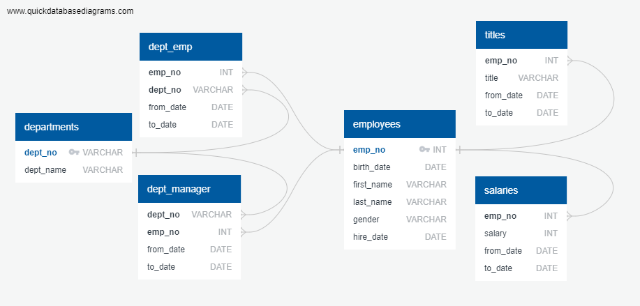
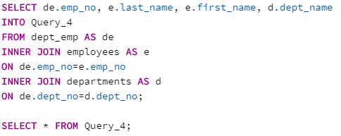
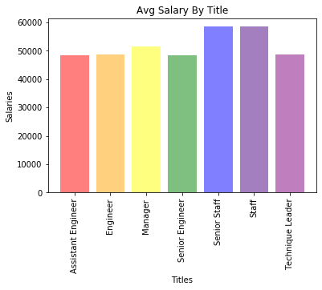

# SQL-Challenge

## Technical Report

    Use SQL for: (1) Data Modeling,  (2) Data Engineering, and  (3) Data Analysis

In this assignment, I used the following tools:
    > QuickDBD (www.quickdatabasediagrams.com) to build my Entity Relationship Diagram (ERD).
    > PostgreSQL to build and query my database.
    > Jupyter Notebook where I imported the sqlalchemy tool to create visuals for my data.

(1) Data Modeling

After inspecting and comparing the six given CSV files, I determined the dept_no column from "departments".csv and the emp_no column from "employees".csv as the Primary Keys for my database. The "dept_emp" & "dept_manager" CSV files have 2 foreign keys while "titles" and "salaries" have one.

My ERD was organized in a hierarchichal chain. I believe this best represents how the primary and foreign keys are linked. It starts with the "departments" table linked to the "dept_emp" and "dept_manager" tables by the dept_no key. The two tables are then linked to the "employees" table by the emp_no key--as are the "titles" and "salaries" tables, the final entities of the chain.

(2) Data Engineering and Analysis

SQL's concise syntax and quick runtime simplified this process.

Using the schemata to program my ERD from QuickDBD, I created the tables in the PostgreSQL database. Each CSV file was imported to it's respective table.

Querying my Database:
    > Used an alias to quickly log and generate the needed data per query
    > Joined original tables into new tables (8 total, 1 per query)
    > Statements used:
        >> SELECT, FROM, AS, INTO, INNER JOIN,
        ON, WHERE, AND, OR, BETWEEN,
        LIKE, COUNT, GROUP BY, ORDER BY, & DESC

Bonus Question (Jupyter Notebook):
    > Dependencies used:
        >> pandas, sqlalchemy, numpy, and matplotlib
    > With sqlalchemy I connected my database to jupyter notebook to pull and manipulate data
        >> Also used to convert tables to pandas dataframes
    > Used "pd.read_sql" to use SQL syntax to query my database for the 'salaries' and 'titles' tables
    > Inner joined the dataframes using "pd.merge()" using PK "emp_no"
    > Grouped titles and found the average salaries using the ".groupby" and ".mean()" functions
    > Cleaning
        >> Dropped 'emp_no' column using "drop()"
        >> Resetted the index using ".reset_index()" so the title column becomes a value for the plot
        >> Rounded the salaries to 2 decimal points using ".round()"
    > Used "plt.bar" to create the final chart

Issues:
    > Dismissed the difference between the AND & OR clauses
        >> Couldn't query #7 until I switched AND to OR
    > Had to pull "dept_emp" from the repopisitory several times because it was empty
    > Created new tables in the database when joining tables in anticipation of using at least on of them in the bonus
        >> Found out neither were useful and had to join 2 tables using sqlalchemy

Final Product:

Blurbs:
    > The salaries of each title ranged from $48K to $60K
    > Senior Staff and Staff equally have the highest salaries (nearly $60K/year)
    > Assistant Engineers, Engineers, Senior Engineers, and Technique Leaders make about $48K/ year
    > Managers reach $50K/ year
